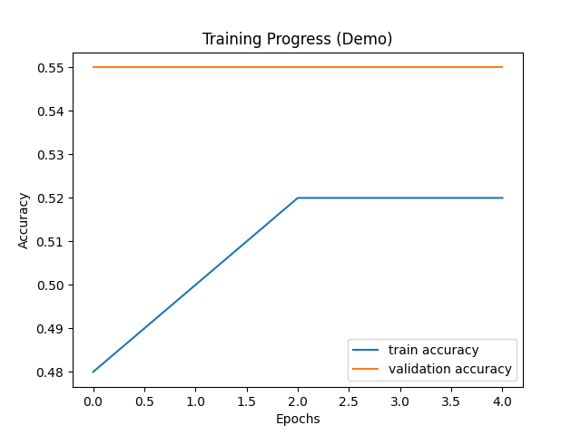

# Skin-Cancer-Detection-using-CNN-Deep-Learning-

This project demonstrates a **Convolutional Neural Network (CNN)** model that detects **malignant (cancerous)** and **benign (non-cancerous)** skin lesions using deep learning.  
It is a **demo version** that works even without an external dataset by generating synthetic data, helping visualize model training and accuracy trends.

---

## Features
- Builds and trains a CNN model using TensorFlow & Keras.
- Classifies images into **cancerous vs. non-cancerous** categories.
- Displays **real-time training accuracy and validation accuracy** using Matplotlib.
- Beginner-friendly project to understand **medical image classification**.
- Can be extended to use real datasets like **ISIC 2020** for research purposes.

---

## Technologies Used
- **Python 3.11+**
- **TensorFlow / Keras** – CNN model building  
- **NumPy, Matplotlib** – data simulation & visualization  
- **scikit-learn** – preprocessing and data splitting  

---
## Output Preview

| Training Graph (Accuracy Progress) |
|------------------------------------|
| 
 


---

## Model Summary (Demo)
| Metric | Value |
|--------|--------|
| Epochs | 5 |
| Training Accuracy | ~52% |
| Validation Accuracy | ~55% |

---

## 🔧 How to Run
1. Clone this repository  
   ```bash
   git clone https://github.com/simrankhokale/skin-cancer-detection.git
